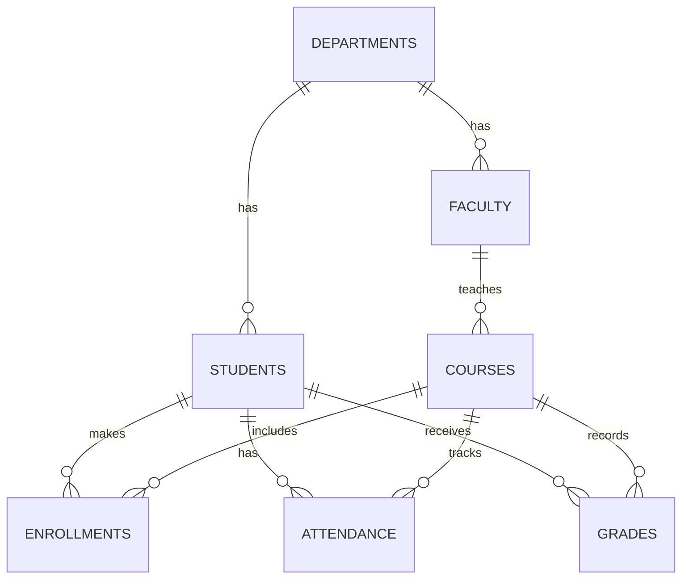

<div align="center">

# 🎓 Student Performance & Attendance Tracker

**A MySQL database for managing students, faculty, attendance, and academic performance.**


</div>

---

## 📖 Table of Contents

- [Objective](#-objective)
- [Problem Statement](#-problem-statement)
- [Database Schema](#-database-schema)
- [Entity Relationships](#-entity-relationships)
- [Setup](#️-setup)
- [Query Catalogue](#-query-catalogue)
- [Files](#-files)
- [Tech Stack](#-tech-stack)

---

## 🎯 Objective

Build a **Student Performance & Attendance Tracker** using MySQL where an institution can manage student & faculty info, log attendance, track marks, and generate simple performance/attendance reports.

## 📋 Problem Statement

| Goal | What it covers |
|---|---|
| **Manage Records** | Add, update, delete students & faculty |
| **Track Attendance** | Daily logging + attendance % |
| **Analyze Performance** | Marks, grades, subject-wise trends |
| **Generate Reports** | Top scorers, attendance defaulters |

---

## 🗂️ Database Schema

<table>
<tr><th>Table</th><th>Column</th><th>Type</th><th>Key</th></tr>
<tr><td rowspan="2"><b>Departments</b></td><td>department_id</td><td>INT</td><td>PK</td></tr>
<tr><td>department_name</td><td>VARCHAR(100)</td><td></td></tr>
<tr><td rowspan="5"><b>Faculty</b></td><td>faculty_id</td><td>INT</td><td>PK</td></tr>
<tr><td>name</td><td>VARCHAR(100)</td><td></td></tr>
<tr><td>email</td><td>VARCHAR(100)</td><td></td></tr>
<tr><td>phone_number</td><td>VARCHAR(20)</td><td></td></tr>
<tr><td>department_id</td><td>INT</td><td>FK → Departments</td></tr>
<tr><td rowspan="9"><b>Students</b></td><td>student_id</td><td>INT</td><td>PK</td></tr>
<tr><td>name</td><td>VARCHAR(100)</td><td></td></tr>
<tr><td>dob</td><td>DATE</td><td></td></tr>
<tr><td>gender</td><td>ENUM</td><td></td></tr>
<tr><td>email</td><td>VARCHAR(100)</td><td></td></tr>
<tr><td>phone_number</td><td>VARCHAR(20)</td><td></td></tr>
<tr><td>address</td><td>VARCHAR(255)</td><td></td></tr>
<tr><td>admission_date</td><td>DATE</td><td></td></tr>
<tr><td>department_id</td><td>INT</td><td>FK → Departments</td></tr>
<tr><td rowspan="3"><b>Courses</b></td><td>course_id</td><td>INT</td><td>PK</td></tr>
<tr><td>course_name</td><td>VARCHAR(100)</td><td></td></tr>
<tr><td>faculty_id</td><td>INT</td><td>FK → Faculty</td></tr>
<tr><td rowspan="4"><b>Enrollments</b></td><td>enrollment_id</td><td>INT</td><td>PK</td></tr>
<tr><td>student_id</td><td>INT</td><td>FK → Students</td></tr>
<tr><td>course_id</td><td>INT</td><td>FK → Courses</td></tr>
<tr><td>enrollment_date</td><td>DATE</td><td></td></tr>
<tr><td rowspan="5"><b>Attendance</b></td><td>attendance_id</td><td>INT</td><td>PK</td></tr>
<tr><td>student_id</td><td>INT</td><td>FK → Students</td></tr>
<tr><td>course_id</td><td>INT</td><td>FK → Courses</td></tr>
<tr><td>attendance_date</td><td>DATE</td><td></td></tr>
<tr><td>status</td><td>ENUM(Present,Absent,Late)</td><td></td></tr>
<tr><td rowspan="5"><b>Grades</b></td><td>grade_id</td><td>INT</td><td>PK</td></tr>
<tr><td>student_id</td><td>INT</td><td>FK → Students</td></tr>
<tr><td>course_id</td><td>INT</td><td>FK → Courses</td></tr>
<tr><td>marks_obtained</td><td>DECIMAL(5,2)</td><td></td></tr>
<tr><td>grade</td><td>VARCHAR(5)</td><td></td></tr>
</table>

> 🔒 `Enrollments` has a `UNIQUE(student_id, course_id)` constraint — a student can't enroll in the same course twice.

## 🔗 Entity Relationships



---

## ⚙️ Setup

```bash
mysql -u your_username -p < student_tracker.sql
```

This creates the `student_tracker` database, all 7 tables, sample data, and every required query in one file.

---

## 🧠 Query Catalogue

| # | Section | Highlights |
|---|---|---|
| 1 | **CRUD Operations** | Insert / update / delete students |
| 2 | `WHERE`, `HAVING`, `LIMIT` | Department filter, top 10 scorers, attendance < 75% |
| 3 | `AND`, `OR`, `NOT` | Failing + low attendance, high scorers, unassigned faculty |
| 4 | `ORDER BY`, `GROUP BY` | Alphabetical list, students per dept, avg marks per course |
| 5 | Aggregate Functions | Overall attendance %, max/min marks, students per dept |
| 6 | PK/FK Relationships | Duplicate-enrollment prevention, faculty–course link |
| 7 | Joins | `INNER`, `LEFT`, `RIGHT`, emulated `FULL OUTER` |
| 8 | Subqueries | Above-average scorers, CS dept courses, chronic absentees |
| 9 | Date & Time Functions | Month trends, years since admission, `DD-MM-YYYY` |
| 10 | String Functions | Uppercase, trim, `NULL` email fallback |
| 11 | Window Functions | `RANK()`, cumulative attendance %, running enrollment total |
| 12 | `CASE` Expressions | Performance levels, attendance categories |

> ℹ️ MySQL has no native `FULL OUTER JOIN` — Section 7 emulates it with `LEFT JOIN` + `RIGHT JOIN` combined via `UNION`.

---
## video demo
[](https://drive.google.com/file/d/1HLP8tHOisDFLGyaVp49TI1NL-7rEjbGs/view?usp=sharing)

---
## 📁 Files

```
├── student_tracker.sql   # schema, sample data, and all queries
└── README.md             # this file
```

## 🛠️ Tech Stack

- **Database:** MySQL 8.0+ (window functions require 8.0+)
- **Concepts used:** DDL/DML, joins, subqueries, window functions, `CASE`, string & date functions

---

<div align="center">

*Add your name, course/module, and submission date here before publishing.*

</div>
